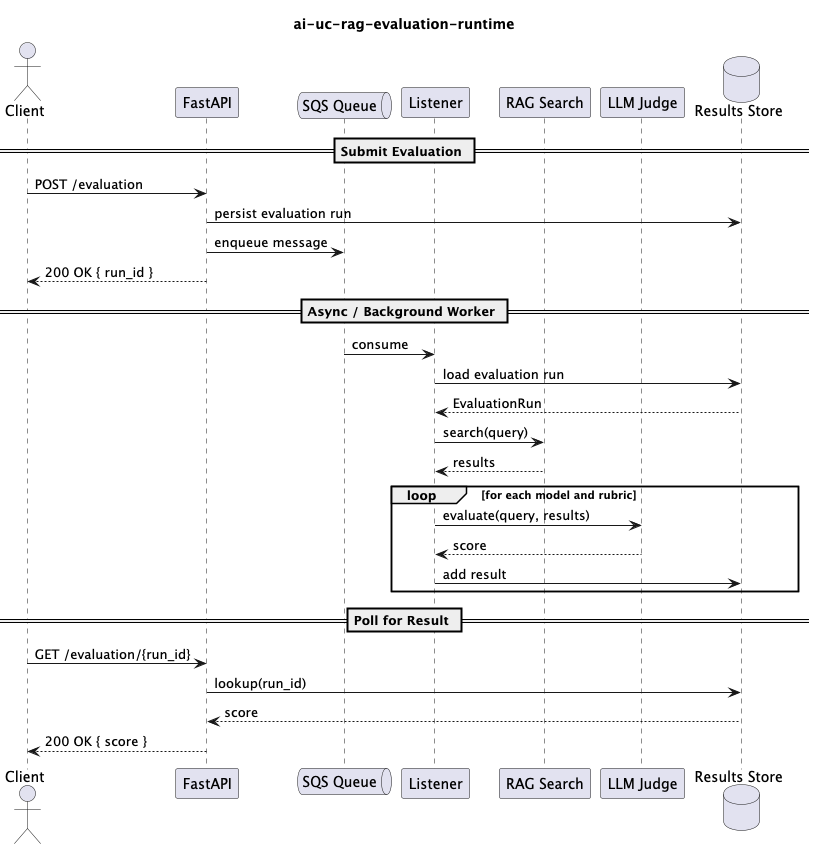

# LLM as a Judge — Technical Pattern

This repository contains a technical pattern for implementing LLM as a Judge. LLM-As-A-Judge requires asking an LLM to 
score one response in relation to a ground-truth (the assumed ideal response), using a detailed prompt (rubric).

The implementation of this pattern can be found in the following 3 repositories:

- [ai-uc-rag-evaluation-ui](https://github.com/DEFRA/ai-uc-rag-evaluation-ui) — UI for setting up data and viewing results
- [ai-uc-rag-evaluation-data](https://github.com/DEFRA/ai-uc-rag-evaluation-data) — Backend to access and insert data into the vector store
- [ai-uc-rag-evaluation-runtime](https://github.com/DEFRA/ai-uc-rag-evaluation-runtime) — Backend to run the LLM as a judge evaluations

This pattern was based on the initial spikes looking at evaluating LLM results:

- [ai-spike-llm-validation](https://github.com/DEFRA/ai-spike-llm-validation/blob/main/experiment-writeup.md)
- [ai-spike-evaluation-metrics](https://github.com/DEFRA/ai-spike-evaluation-metrics/blob/main/experiment-writeup.md)

Key findings from the spikes:

- LLM as a judge is an effective metric for evaluating generative AI responses against a known ground truth.
- Of the implementations tested, pydantic-ai's `LLMJudge` performed best.
- The rubric is critical to the quality of the judgement.

Based on these findings, this pattern uses pydantic-ai with support for multiple rubrics, enabling comparison of 
judgement scores.

## Who this pattern is for

This pattern is targeted at developers and QA who are looking to implement LLM as a Judge on CDP or need to evaluate the
response from generative AI in an automated fashion.

## The problem

As part of the Large Language Model (LLM) validation framework we need a process for comparing LLM responses to known 
ground truths, e.g. comparing the answers to questions with the known correct answer or comparing LLM generated 
summaries to the human-written equivalent. This repository aims to provide a reference implementation for how LLM as a
judge can be used on the CDP platform.

## The solution

The flow has three phases:

### Submit Evaluation
A client sends a POST /evaluation request to the FastAPI service. The service persists the evaluation run to the Results
Store, enqueues a message on the SQS queue, then returns a 200 OK response containing a run_id.

### Async / Background Worker
The Listener consumes the message from SQS and loads the evaluation run from the Results Store. It then performs a RAG
search using the query from that run. With the search results in hand, the Listener loops over each model and rubric 
combination — for each iteration it sends the query and results to the LLM Judge for evaluation, receives a score back, 
and stores that result against the run in the Results Store.

### Poll for Result
The client polls for the outcome by sending a GET /evaluation/{run_id} request. FastAPI looks up the run in the Results
Store and returns the score in a 200 OK response.



The LLM as a judge is evaluated behind an SQS queue as this is expected to be a long-running process. Currently, 
messages need to be processed within the visibility timeout of the message otherwise they could be reprocessed (30 
seconds by default in CDP). As there currently is only a single listener in practice this is not causing an issue but 
for a real system this may need some more thought.

If an exception is raised whilst running LLM as a judge then the message will be retried after the visibility timeout 
has passed. On CDP by default a message will be retried 3 times before being moved to a DLQ. This will prevent stuck 
messages that keep on being evaluated(This could cause significant cost if the LLM keeps being executed on bedrock in a 
stuck loop). For the same reason care must be taken to not rerun any evaluations that have already been Judged by the 
LLM on retries. This can be seen in the queue_listener.py where a tuple containing the query, rubric, model_key are 
checked to see if they are in the done list.

This repository makes use of pydantic-ai and pydantic-evaluation. This library allows us to execute LLM models in 
Bedrock and use the inference profiles and guardrails required by CDP. See how the models are constructed in 
`judge_service.py`. Guardrails are added to the model settings, and the inference profile ARN is used as the Bedrock 
model ID. A profile also needs to be set on the Bedrock model, constructed from the provider and the actual model ID, 
so that pydantic-ai knows internally which model is being used.

```python
_provider = BedrockProvider(region_name=aws_region)
_settings = BedrockModelSettings(
      bedrock_guardrail_config={
          "guardrailIdentifier": guardrails_id,
          "guardrailVersion": guardrails_version,
          "trace": "enabled",
      }
  )

BedrockConverseModel(
    inference_profile_arn,
    provider=_provider,
    profile=_provider.model_profile(model_id),
    settings=_settings,
)
```
At the time of writing not all models allow a provider to be set and may need to be extended to allow this. An example 
of this can be seen with the bedrock embedding model in the ai-uc-rag-evaluation-data project 
app/common/embedding/pydantic_ai.py.

## Licence

THIS INFORMATION IS LICENSED UNDER THE CONDITIONS OF THE OPEN GOVERNMENT LICENCE found at:

<http://www.nationalarchives.gov.uk/doc/open-government-licence/version/3>

The following attribution statement MUST be cited in your products and applications when using this information.

> Contains public sector information licensed under the Open Government license v3

### About the licence

The Open Government Licence (OGL) was developed by the Controller of Her Majesty's Stationery Office (HMSO) to enable
information providers in the public sector to license the use and re-use of their information under a common open
licence.

It is designed to encourage use and re-use of information freely and flexibly, with only a few conditions.
