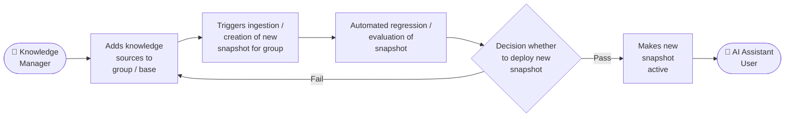
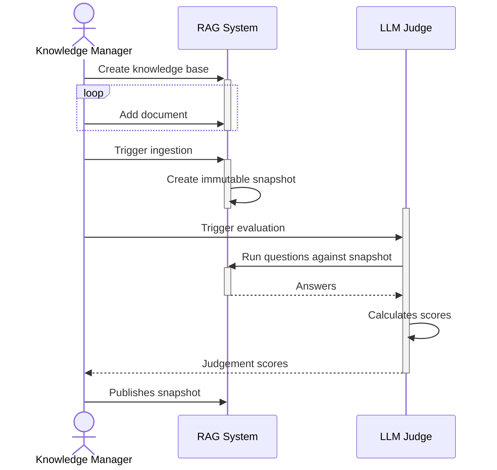

# Evaluating AI Generated Content

## Problem

Changes to a knowledge base can have a detrimental effect on the quality of a RAG system. New content may contradict
existing knowledge, introduce errors, or update facts incorrectly. For example, if a knowledge base correctly states
that the capital of France is Paris, adding a document that incorrectly states it is London may cause a RAG system to
return wrong answers. A process to validate knowledge base updates before they are published would mitigate this risk.

### Current (as-is) process

A knowledge manager adds new content to the knowledge base. The RAG system ingests this data to create a new immutable
knowledge snapshot. Manual checks are carried out to verify that answers from the new snapshot are consistent with 
previous answers. The snapshot is then made active and users can access the updated knowledge. This process is manual 
and cannot be comprehensive.

### To-be process

A knowledge manager adds new content to the knowledge base. The RAG system ingests this data to create a new immutable
knowledge snapshot. An automated regression test is triggered against the snapshot, running a set of questions through 
the RAG system and comparing the answers against known good answers. If the snapshot is judged to have provided good 
enough answers, it is made active and users can access the updated knowledge.

### Requirements

Implementing this process requires two things:

- A set of questions and known good answers that a RAG system built on the knowledge base would be able to answer.
- A mechanism to compare the snapshot's answers against the known good answers. Since an LLM is unlikely to produce an
identical response, answers with the same meaning should be considered correct.
  - e.g. these answers below should be considered equal
    - The capital of France is Paris
    - Paris is the capital city of France.

### Judge
Prior spike work evaluated several mechanisms for judging AI-generated content.

This pattern was based on the initial spikes looking at evaluating LLM results:

- [ai-spike-llm-validation](https://github.com/DEFRA/ai-spike-llm-validation/blob/main/experiment-writeup.md)
- [ai-spike-evaluation-metrics](https://github.com/DEFRA/ai-spike-evaluation-metrics/blob/main/experiment-writeup.md)

The most promising mechanism from this work was LLM as a Judge. Where a question and known good answer along with the
result of an AI request were passed to an LLM. The LLM is then asked to compare the two answers and score how well the 
new response answers the question.

If this was done for a suite of questions and answers the scores of the LLM as a Judge could be averaged out and 
compared to a previous snapshot score or against a threshold to decide if a new knowledge snapshot should be made 
public.

### User flow

