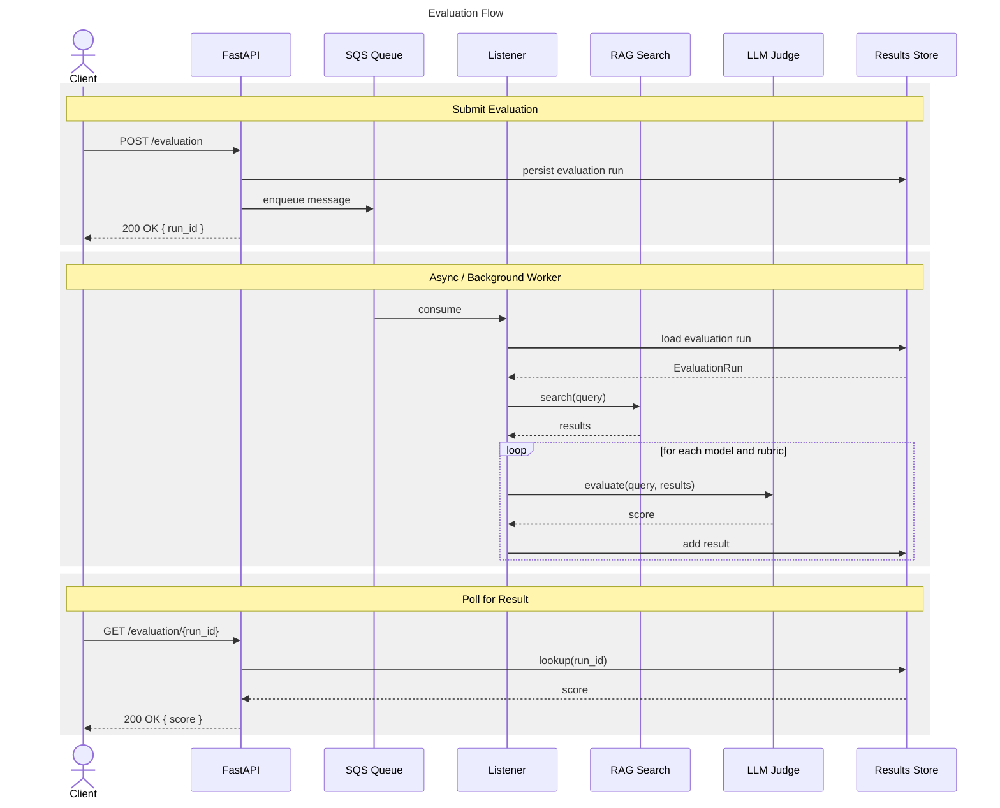

# LLM as a Judge

See the [glossary](../glossary.md) for definitions of key terms.

The flow has three phases:

## Submit Evaluation
A client sends a POST /evaluation request to the FastAPI service. The service persists the evaluation run to the Results
Store, enqueues a message on the SQS queue, then returns a 200 OK response containing a run_id.

## Async / Background Worker
The Listener consumes the message from SQS and loads the evaluation run from the Results Store. It then performs a RAG
search using the query from that run. With the search results in hand, the Listener loops over each model and rubric 
combination — for each iteration it sends the query and results to the LLM Judge for evaluation, receives a score back, 
and stores that result against the run in the Results Store.

## Poll for Result
The client polls for the outcome by sending a GET /evaluation/{run_id} request. FastAPI looks up the run in the Results
Store and returns the score in a 200 OK response.



The LLM as a judge is evaluated behind an SQS queue as this is expected to be a long-running process. Currently, 
messages need to be processed within the visibility timeout of the message otherwise they could be reprocessed (30 
seconds by default in CDP). As there currently is only a single listener in practice this is not causing an issue but 
for a real system this may need some more thought.

If an exception is raised whilst running LLM as a judge then the message will be retried after the visibility timeout 
has passed. On CDP by default a message will be retried 3 times before being moved to a DLQ. This will prevent stuck 
messages that keep on being evaluated(This could cause significant cost if the LLM keeps being executed on bedrock in a 
stuck loop). For the same reason care must be taken to not rerun any evaluations that have already been Judged by the 
LLM on retries. This can be seen in the queue_listener.py where a tuple containing the query, rubric, model_key are 
checked to see if they are in the done list.

This repository makes use of pydantic-ai and pydantic-evaluation. This library allows us to execute LLM models in 
Bedrock and use the inference profiles with the guardrails required by CDP. See how the models are constructed in 
`judge_service.py`. Guardrails and inference profile arn are added to the model settings. 

```python
BedrockConverseModel(
    model_id,
    provider=BedrockProvider(region_name=aws_region),
    settings=BedrockModelSettings(
        bedrock_guardrail_config={
            "guardrailIdentifier": guardrails_id,
            "guardrailVersion": guardrails_version
        },
        bedrock_inference_profile=inference_profile_arn,
    )
```